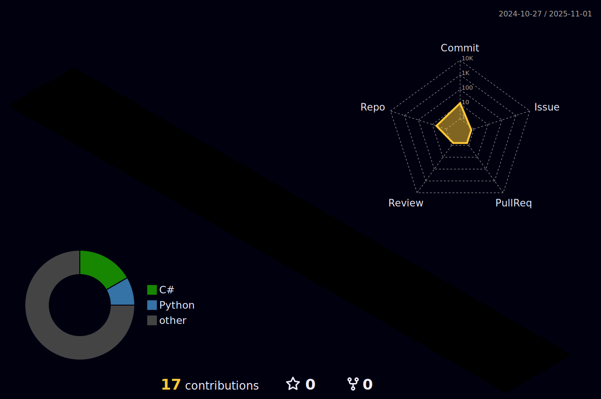

  
  |  |  |  
 | ----------- | ----------- |

  

  

    
   
      

  
  

<picture>
  <source media="(prefers-color-scheme: dark)" srcset="https://raw.githubusercontent.com/vitorscallen/vitorscallen/output/github-contribution-grid-snake-dark.svg">
  <source media="(prefers-color-scheme: light)" srcset="https://raw.githubusercontent.com/vitorscallen/vitorscallen/output/github-contribution-grid-snake.svg">
  
</picture>
